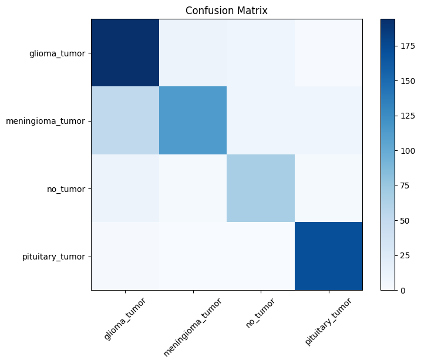

# Brain Tumor Classification using Deep Learning

This project implements a Convolutional Neural Network (CNN) for classifying brain tumor MRI images into four categories: glioma tumor, meningioma tumor, no tumor, and pituitary tumor.

## Table of Contents
- [Brain Tumor Classification using Deep Learning](#brain-tumor-classification-using-deep-learning)
  - [Table of Contents](#table-of-contents)
  - [Installation](#installation)
  - [Dataset](#dataset)
  - [Usage](#usage)
  - [Tumour Classifier](#tumour-classifier)
  - [Model Architecture](#model-architecture)
  - [Results](#results)

## Installation

To run this project, you need to have the following dependencies installed:

- Python 3.x
- NumPy
- OpenCV (cv2)
- scikit-learn
- matplotlib
- TensorFlow

You can install the required packages using pip:

```python 
pip install numpy opencv-python scikit-learn matplotlib tensorflow
```
## Dataset

The project uses the Brain Tumor Classification Dataset, which can be downloaded from the following GitHub repository:

[Brain-Tumor-Classification-DataSet](https://github.com/SartajBhuvaji/Brain-Tumor-Classification-DataSet.git)

The dataset is automatically cloned when running the script.

## Usage

1. Clone this repository to your local machine.
2. Ensure you have all the required dependencies installed.
3. Run the script:


## Tumour Classifier

The script will download the dataset, preprocess the images, train the model, and display the results.

## Model Architecture

The CNN model architecture is as follows:

1. Convolutional layer (32 filters, 3x3 kernel)
2. Max pooling layer (2x2)
3. Flatten layer
4. Dense layer (64 neurons)
5. Output layer (4 neurons, softmax activation)

The model is compiled using the Adam optimizer and Sparse Categorical Crossentropy loss function.

## Results

The model achieves an accuracy of 83.46% on the test set. 

A confusion matrix and a detailed classification report are generated to evaluate the model's performance across different tumor types.


